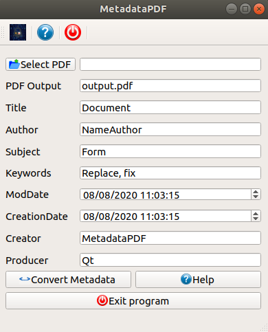

-------------------------------------------------------------
# MetadataPDF
Simple program to change the metadata in PDF files

Fernando Mendiburu - 2020
-------------------------------------------------------------

<p align="center">
  
</p>

# Table of Contents

- [Installation](#installation)
- [Dependences](#Dependences)
- [User Guide](#User-Guide)

## Installation

Go to `/home/user` directory:

```
$ cd ~
```

Download from [here](https://github.com/fermendi/MetadataPDF/archive/master.zip) or using git clone:

```
$ git clone https://github.com/fermendi/MetadataPDF.git
```

Create the build folder:

```
$ cd ~/MetadataPDF
$ mkdir build
$ cd build
```

For Linux, compile using the following commands:

```
$ qmake ~/MetadataPDF/MetadataPDF.pro -spec linux-g++ && /usr/bin/make qmake_all
$ make
```

## Dependences

`Qt`

`Ghostscript`

### Ghostscript tips

See the tips in this [page](http://milan.kupcevic.net/ghostscript-ps-pdf/)

## User Guide

`MetadataPDF` GUI is shown below:

<p align="center">
  
</p>


1. Press the button `"Select PDF"`.

2. Select the PDF tha you want to change the metadata (PDF name or path file without spaces).

3. Change the fields of the metadata file as desired (title, author, etc).

4. Press the button `"Convert Metadata`.

5. Find the output file with the desired metadata in the same path of the original PDF file.
