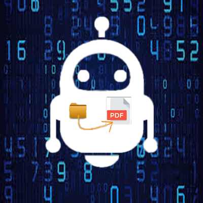

-------------------------------------------------------------
# MetadataPDF
Simple program to change metadata, split, OCR, and merge PDF files

Fernando Mendiburu - 2020
-------------------------------------------------------------

<p align="center">
  
</p>

# Table of Contents

- [Installation](#installation)
- [Dependences](#Dependences)
- [User Guide](#User-Guide)

<p align="center">
  
</p>


## Installation

Go to `/home/user` directory:

```
$ cd ~
```

Download from [here](https://github.com/fermendi/MetadataPDF/archive/master.zip) or using git clone:

```
$ git clone https://github.com/fermendi/MetadataPDF.git
```

Create the build folder:

```
$ cd ~/MetadataPDF
$ mkdir build
$ cd build
```

For Linux, for example compile using qmake and the following commands:

```
$ qmake ~/MetadataPDF/MetadataPDF.pro -spec linux-g++ && /usr/bin/make qmake_all
$ make
```

## Dependences

`Qt`

`Ghostscript`

`OCR tools`

#### Ghostscript tips

See the tips in this [page](http://milan.kupcevic.net/ghostscript-ps-pdf/).

#### Frameless window

MetadataPDF project uses a modification of a MainWindow class with frameless window,
for more information about the project click [here](https://github.com/Jorgen-VikingGod/Qt-Frameless-Window-DarkStyle).

#### OCR tools

Optical Character Recognition (OCR) is the conversion of scanned images of handwritten, typewritten or printed text into searchable, editable documents.

```
$ sudo apt-get install ocrmypdf
```

## User Guide

`MetadataPDF` GUI for change Metadata is shown below:

<p align="center">
  
</p>


1. Press the button `"Select PDF"`.

2. Select the PDF that you want to change the metadata (PDF name and path file without spaces).

3. Change the fields of the metadata file as desired (title, author, etc).

4. Press the button `"Convert Metadata"`.

5. Find the output file with the desired metadata in the same path of the original PDF file.


`MetadataPDF` GUI for splitting PDF files is shown below:

<p align="center">
  
</p>


1. Press the button `"Select PDF"`.

2. Choose the PDF of `n` pages.

3. Press `"Split PDF"`, you'll obtain `n` PDFs.


`MetadataPDF` GUI for merge PDF files is shown below:

<p align="center">
  
</p>


1. Add PDF files using button `"Add PDF"`.

2. Remove files added incorrectly (`"Remove last PDF"` button).

3. Press the button `"Merge PDFs"`, merged file is saved as `"MetadataPDF_Merged.pdf"`.


`MetadataPDF` GUI for recognize PDF files using OCR:

<p align="center">
  
</p>


1. Select the PDF to recognize characters (`"Select PDF"` button).

2. Press `"OCR PDF"` button to start the conversion (this could take time!).


